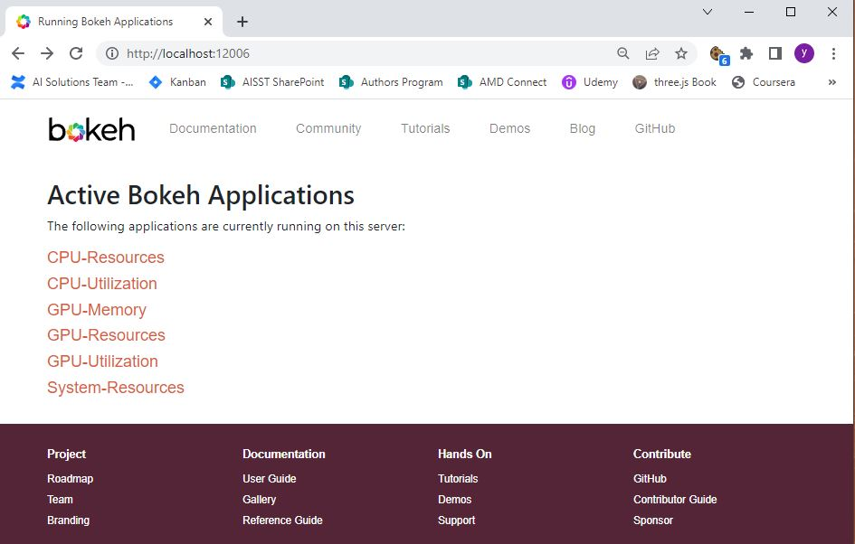
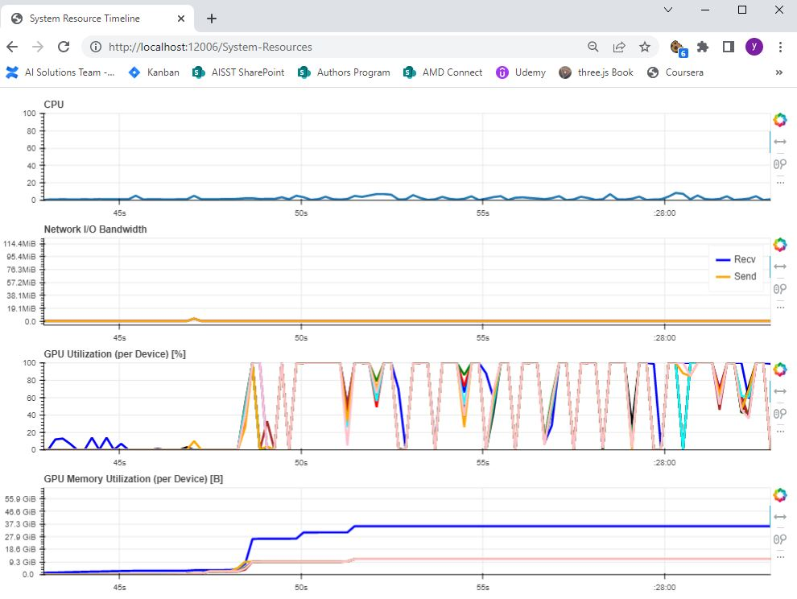
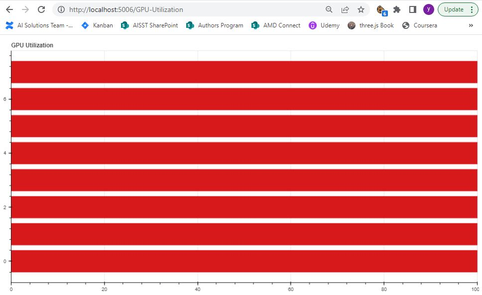
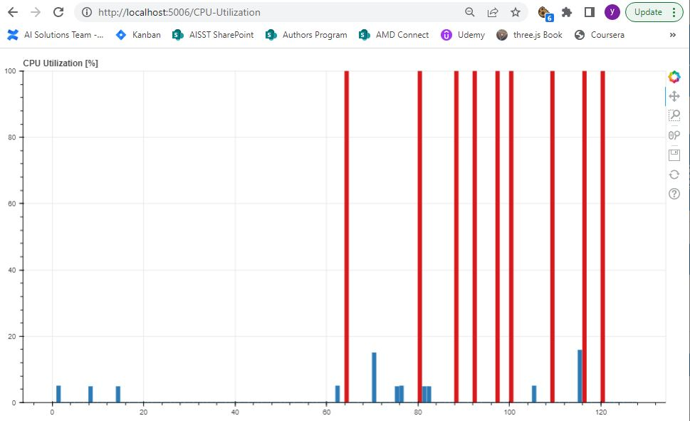

# Examples of using `pyrsmi` package

## `cli` Directory

- Displays selected info of the available devices
  - `python device_info.py`
  - Output:

```
no. of devices = 8

device id       device name     total memory(GB)  used memory(MB)
-----------------------------------------------------------------
     0    AMD Instinct MI350X           270.57          297.77
     1    AMD Instinct MI350X           270.57          297.77
     2    AMD Instinct MI350X           270.57          297.77
     3    AMD Instinct MI350X           270.57          297.77
     4    AMD Instinct MI350X           270.57          297.77
     5    AMD Instinct MI350X           270.57          297.77
     6    AMD Instinct MI350X           270.57          297.77
     7    AMD Instinct MI350X           270.57          297.77
```

----------

## `llm_monitoring` Directory

- Monitors GPU utilization, memory usage, and power consumption during LLM inference
- Collects time-series metrics in real-time using a background monitoring thread
- Provides summary statistics and energy consumption estimates

### Quick Start

⚠️ **Important for AMD GPUs**: Use ROCm PyTorch container to avoid installing CUDA PyTorch by mistake.

```bash
cd llm_monitoring

# Method 1: ROCm PyTorch Container (Recommended)
docker pull rocm/pytorch:latest
docker run -it --rm \
  --privileged \
  --network=host \
  --ipc=host \
  --device=/dev/kfd --device=/dev/dri \
  --group-add video \
  --cap-add=SYS_PTRACE \
  --security-opt seccomp=unconfined \
  -v $(pwd):/workspace -w /workspace \
  rocm/pytorch:latest bash
# Inside container: pip install transformers accelerate pyrsmi

# Method 2: Install ROCm PyTorch locally
pip install torch --index-url https://download.pytorch.org/whl/rocm6.1
pip install transformers accelerate pyrsmi

# Run the example
python monitor_llm_inference.py
```

### Features

- Real-time GPU monitoring during LLM workloads
- Time-series data collection at configurable intervals
- Summary statistics (min/max/avg) for utilization, memory, and power
- Energy consumption estimation
- Works with any PyTorch-based LLM (GPT-2, LLaMA, etc.)

### Example Usage

```bash
# Monitor with custom prompt
python monitor_llm_inference.py --prompt "Explain quantum computing"

# High-resolution monitoring (50ms intervals)
python monitor_llm_inference.py --interval 0.05 --show-timeseries

# Monitor specific GPU
python monitor_llm_inference.py --device 1
```

See the [llm_monitoring/README.md](llm_monitoring/README.md) for detailed documentation.

----------

## `system_dashboard` Directory
- Web-based dashboards that shows sytem status of CPU, GPU, memory and network. It uses [Bokeh server](https://docs.bokeh.org/en/latest/docs/user_guide/server.html) for real-time processing of system data along with pyrsmi (GPU) and psutil (CPU).

### Setup
- Get a ROCm-enabled AMD GPU system
- Create Python virtual environment (tested on Python 3.9.13):<br>
  `python -m venv [virt env name]`
- Activate the virtual environment: <br>
  `source [virt env name]/bin/activate`
- Install `pyrsmi` package (from PyPI)
- Check ROCm availability by running cli app (optional):<br>
  `python ../cli/device_info.py`
- Install required packages:<br>
  `python -m pip install -r requirements.txt`
- Start the server:<br>
  `python server.py [port]`
- Set up port forwarding for remote view (default port: 5006)
- Open the browser: https://localhost:[port | 5006]

### Results
- System dashboard front page:
  
- System Resources sample (CPU + GPU):
  
- GPU Utilization sample:
  
- CPU Utilization sample:
  

  